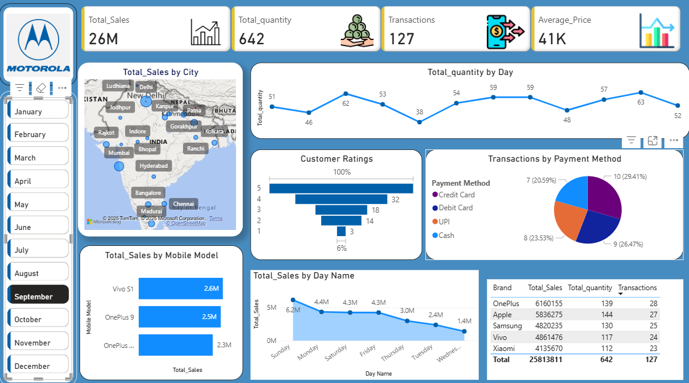

# Motorola Sales Dashboard (Power BI)

## Project Overview

This project presents an interactive Power BI dashboard that analyzes Motorola mobile sales across different cities in India. The dashboard highlights key business metrics and provides insights into sales performance, customer behavior, and transaction trends.

## Key Metrics

* **Total Sales:** 2.6M
* **Total Quantity Sold:** 642
* **Total Transactions:** 127
* **Average Price:** 41K

## Dashboard Features

* Sales distribution by **city**
* Total quantity sold by **day**
* **Customer rating** analysis
* Transactions by **payment method**
* Sales performance by **mobile model**
* **Day-wise sales trend** analysis
* **Month filter** for interactive exploration

## Tools & Technologies

* Power BI Desktop
* Data Visualization
* Data Analysis

## Dashboard Preview

## Live Dashboard

https://app.powerbi.com/groups/me/reports/02f22c91-89cd-40db-a36d-05e5ed32a05c?ctid=0c2c5eb2-7477-4593-ac08-f1de3be027d2&pbi_source=linkShare

## Author

Saumya Jain
